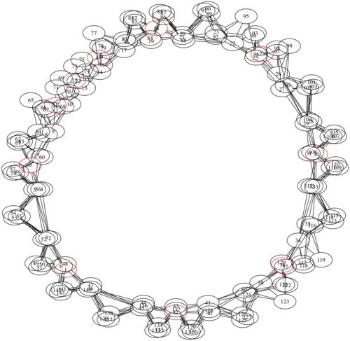
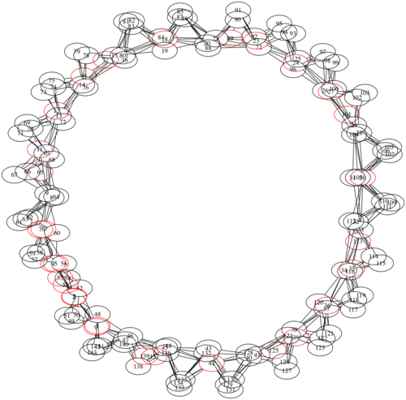
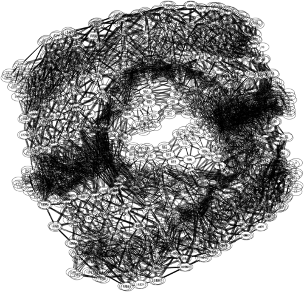

## mars

`mars` is a graph drawing tool for large graph visualization. `mars` can compute stress majorization based layouts for graphs with as many as several hundred thousand nodes. This is well beyond the limits of standard stress majorization layout algorithms, including those implemented in the Graphviz program `neato`. 

## Build

### Preliminary requirements
`mars` requires LAPACK, OpenGL, and cgraph - included in the Graphviz library.

* On Mac OSX these packages can be installed using brew:

        brew install lapack
        brew install graphviz

* On Linux these packages can be installed using apt-get:

        sudo apt-get install liblapack-dev
        sudo apt-get install graphviz graphviz-dev libcgraph5
        sudo apt-get install libgl1-mesa-dev libglu1-mesa libglu1-mesa-dev freeglut3 freeglut3-dev

### Mac OSX and *nix

1. cd into your top-level directory, e.g. `cd ~/workspace`
1. from your top-level directory, clone the mars repo

        git clone https://github.com/marckhoury/mars.git

1. cd into the mars directory

        cd mars/

1. run the build script
        
        ./build.sh

## Execution
`mars` is a command line tool written in the same style as any Graphviz program. To display the help message run:

        ./mars -?
        Usage: mars [-k k] [-p power] [-d dim] [-s scale] [-i iter] [-o outfile] [-cvg?]
          -k k       - sample k columns from the full laplacian matrix
          -p power   - exponent of the weight matrix
          -d dim     - dimension of the layout
          -s scale   - scale the layout by a constant
          -i iter    - set the maximum iterations to converge
          -o outfile - write output graph to file
          -c         - color anchor nodes
          -v         - visualize layout in interactive viewer
          -g         - use given initial layout, else random
          -?         - print help message

* Input graphs must be specified using the [DOT](http://en.wikipedia.org/wiki/DOT_(graph_description_language)) graph description format. If input and output files are not specified, `mars` will read from stdin and write to stdout.
* `-k` Specifies the number of columns to be sampled from the full Laplacian matrix; this is equivalent to the number of anchor nodes used in the algorithm. A single-source shortest path algorithm is run from each anchor node to build the weighted Laplacian matrix. As more columns are sampled the quality of the layout improves at the cost of more computation time and memory. Default value is 100.
* `-p` Specifies the exponent of the weight matrix in the stress majorization algorithm. Different values of the exponent simplify various parts of the stress majorization equations, leading to more accurate approximations. Setting `p = 1` results in a very accurate approximation using a Barnes-Hut simulation. Setting `p = 2` tends to produce better stress majorization layouts, however it requires a more complicated and less accurate modified Barnes-Hut computation based on clustering. Default is `p = 1`.
* `-d` Specifies the dimension of the layout. Usually layouts are computed in 2 or 3 dimensional space, since higher dimensional layouts cannot be visualized. Default is `d = 2`.
* `-s` Specifies a scaling factor to apply to the layout after the initial layout is computed. This is particularly helpful to spread out a layout with a large number of overlapping nodes. Default is `s = 72`.
* `-i` Specifies the maximum number of iterations for the iterative layout algorithm. A larger number of iterations tends to improve the quality of the layout, up to a point, at the cost of additional time. Default is `i = 200`.
* `-o` Specifies the output file. If none is provided `mars` will write to stdout. 
* `-c` Sets the color attribute of the anchor nodes to "red". When rendered with `neato`, the border of the anchor nodes will be colored red instead of black.
* `-v` Launches an interactive 3D viewer. This makes it easy to quickly visualize large graph layouts and is particularly useful for three dimensional layouts. The viewer includes its own menu of options and implements a trackball interface for translations, zooming, and scaling.
* `-g` Expect that a layout specified in the input and start the iterative layout algorithm from the given layout.

Lastly, `mars` only computes a graph layout, it does not implement a renderer. To create a visualization from a graph layout, use `neato`'s renderer by running the following command:

        neato -Tpng -n out.gv > out.png

Instructions on how to use `neato`'s renderer are included in the examples. 

## Examples

The default options should work resonably well for most graph. The simplest example is 

        ./mars -o finance256_layout.gv graphs/finance256.gv
        
which would produce the following output in finance256_layout.gv

        graph G {
            node [color=black];
            edge [weight=1.0];
            1        [pos="500.097581, 394.515101"];
            0        [pos="534.359375, 311.448057"];
            1 -- 0;
            2        [pos="584.120741, 401.860528"];
            2 -- 1;
            3        [pos="632.421334, 435.689317"];
            ...

To visualize the result, we can use `neato`'s renderer to create a static image.

        neato -Tpng -n finance256_layout.gv > finance256.png

The `-n` parameter tells `neato` that the nodes have already been positioned and have a pos attribute giving the positions. The `-T` parameter specifies the output format.

The `-c` parameter will set the color attribute of the anchor nodes to red, making them easier to identify.

        ./mars -c -k 10 graphs/can_144.gv

Increasing the value of `-k` improves the quality of the layout.

        ./mars -c -k 30 graphs/can_144.gv

The `-p` parameter specifies the exponent of the weight matrix. Different values can lead to very different layouts. `mars` implements a very accurate approximation in the case `p = 1`
    
        ./mars -p 1 -o nasa_layout.gv graphs/nasa1824.png

However the approximation is poorer for larger values of `p` even though in standard stress majorization `p = 2` produces the best layouts in practice.

        ./mars -p 2 -o nasa_layout.gv graph/nasa1824.png

`mars` also includes an interactive viewer, specified by the `-v` parameter. This is particularly useful for visualizing three dimensional layouts.

        ./mars -v -d 3 -k 1824 graphs/nasa1824.gv

## Technical Details
Standard stress majorization techniques begin by constructing the weighted Laplacian matrix, which requires computing the all-pairs shortest path matrix. This matrix is dense and is expensive to compute. Instead `mars` samples `k` colmuns from this matrix, choosing vertices that are as far apart as possible in the graph. From these `k` columns, `mars` computes a low-rank approximation to the full weighted Laplacian matrix using a singular value decomposition. 

In the stress majorization formulation, one side of the iterative equation can be reduced to a force calculation if the all-pairs shortest path matrix is raised to the first power, `p = 1`. `mars` exploits this fact by using a Barnes-Hut approximation scheme to efficiently compute these forces without constructing a large dense matrix and performing expensive matrix-vector multiplications. When `p` is some value not equal to 1, `mars` uses a modified Barnes-Hut algorithm based on clustring to avoid computing the all-pairs shortest path matrix.

Combined, these two approximation techniques allow `mars` to scale well beyond the capabilities of `neato`, computing layouts for graph as large as several hundred thousand nodes. 

## Acknowledgements

`mars` is based on the work in [Drawing Large Graphs by Low-Rank Stress Majorization](http://www.cs.berkeley.edu/~khoury/mars.pdf), which was written in collaboration with several researchers at AT&T Labs Research, including [Carlos Scheidegger](http://cscheid.net/), [Shankar Krishnan](http://www.research.att.com/archive/people/Krishnan_Shankar/index.html?fbid=vr6vm_97Cr9) and [Yifan Hu](http://yifanhu.net/index.html). The code in `sfdp/` was written by Yifan Hu, author of the Graphviz program `sfdp`.
